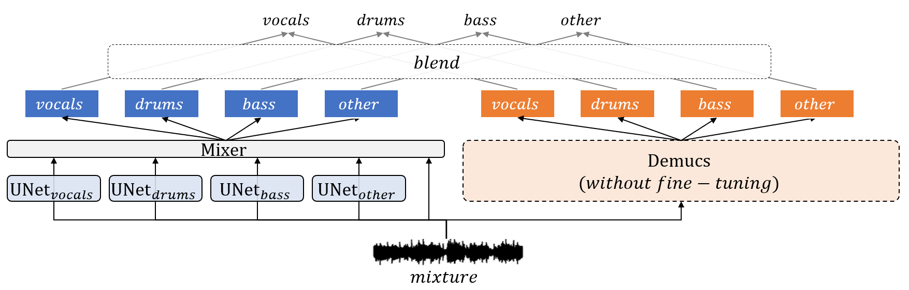
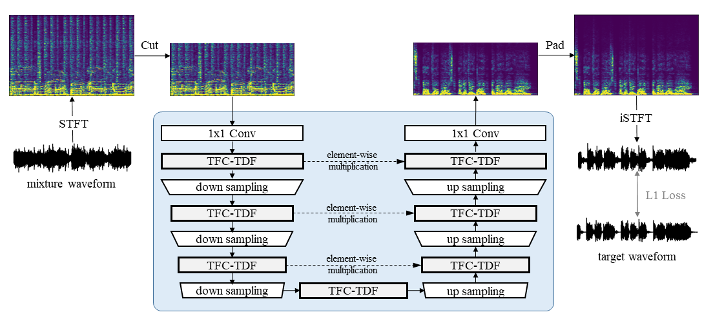

# Summary

Recently, many methods based on deep learning have been proposed for music source separation. Some state-of-the-art methods have shown that stacking many layers with many skip connections improve the SDR performance. Although a deep and complex architecture usually shows outstanding performance, it consumes numerous computing resources and time for training and evaluation. This paper presents a source separation model named KUIELab-MDX-Net. We empirically find a model with a good balance of performance and required resources. It took second place on leaderboard A and third place on leaderboard B in the Music Demixing Challenge at ISMIR 2021. This paper also summarizes experimental results on another benchmark, MusDB18.

# Introduction

Recently, many methods have been proposed for music source separation.
Notably, deep learning approaches [@densenet:2017, @mmdenselstm:2018, @liu:2019, @choi:2020, @d3net:2021, @defossez:2021] have become mainstream because of their excellent performance.
Some state-of-the-art methods [@densenet:2017, @mmdenselstm:2018, @choi:2020, @d3net:2021] have shown that stacking many layers with many skip connections improve the SDR performance.

Although a deep and complex architecture usually shows outstanding performance, it consumes numerous computing resources and time for training and evaluation.
Such disadvantages make them not affordable in a restricted environment where limited resources are provided.
For example, some deep models such as LaSAFT-Net [@choi:2021] exceed the time limit of the Music Demixing Challenge (MDX) at ISMIR 2021 [@mdx:2021] even if they are the current state of the art on the MusDB18 [@musdb:2017] benchmark.

This paper presents a source separation model named KUIELab-MDX-Net.
We empirically found a good balance of performance and required resources to design KUIElab-MDX-Net.
For example, we replaced channel-wise concatenation operations with simple element-wise multiplications for each skip connection between encoder and decoder (i.e., for each U-connection in U-Net).
In our prior experiments, it reduced parameters with neglectable performance degradation.

Also, we removed the other skip connections, especially, skip connections used in dense blocks [@densenet:2017, @mmdenselstm:2018, @choi:2020, @d3net:2021].
We observed that stacked convolutional networks without dense connections followed by Time-Distributed Fully connected layers (TDF) [@choi:2020] could perform comparably to dense blocks without TDFs.
TDF, proposed in [@choi:2020], is a sequence of linear layers. It is applied to a given input in the frequency domain to capture frequency-to-frequency dependencies of the target source.
Since a single TDF block has the whole receptive field in terms of frequency, injecting TDF blocks into a conventional U-Net [@unet:2015] improves the SDR performance on singing voice separation even with a shallower structure.

With several tricks we found a computationally efficient and effective model designs architecture.
KUIELab-MDX-Net took second place on leaderboard A and third place on leaderboard B in the Music Demixing Challenge at ISMIR 2021.
This paper also summarizes experimental results on another benchmark, MusDB18.

# Related work

## Frequency Transformation for Source Separation

## Visualizations

# KUIELab-MDX-Net

As in Figure1, KUIELab-MDX-Net consists of five networks, all trained separately. Figure1 depicts the overall flow at inference time: the four separation models (TFC-TDF-U-Net v2) first estimate each source independently, then the *Mixer* model takes these estimated sources (+ mixture) and outputs enhanced estimated sources.

## TFC-TDF-U-Net v2

The following changes were made to the original TFC-TDF-U-Net architecture:
- For "U" connections, we used multiplication instead of concatenation.
- Other than U connections, all skip connections were removed.
- In TFC-TDF-U-Net v1, the number of intermediate channels are not changed after down/upsamples. For v2, they are increased when downsampling and decreased when upsampling.

On top of these architectural changes, we also use a different loss function (waveform L1 loss) as well as source-specific data preprocessing.
As shown in Figure2, high frequencies that are above the expected frequency range of the target source were cut off from the mixture spectrogram.
This way, we can increase *n_fft* while using the same input spectrogram size (which we needed to contrain for the separation time limit), and using a larger *n_fft* usually leads to better SDR. This is also our main reason we did not use a multi-target model (a single model that is trained to estimate all four sources), where we can't use source-specific frequency cutting.

## Mixer
Although training one separation model for each source can have the benefit of source-specific preprocessing and model configurations, these models lack the knowledge that they are separating using the same mixture. We thought an additional network that *can* exploit this knowledge (which we call the Mixer) could further enhance the "independently" estimated sources.
For example, estimated 'vocals' often have drum snare noises left. The Mixer can learn to remove sounds from 'vocals' that are also present in the estimated 'drums' or vice versa.

During the MDX Challenge we only tried very shallow models (such as a single convolution layer) for the Mixer due to the time limit. We look forward to trying more complex models in the future, since even a single 1x1 convolution layer was enough to make some improvement on total SDR (Section "Performance on the MUSDB Benchmark").

# Experimental Results
In this section we describe the model configurations, STFT parameters, training procedure, and evaluation results on the MUSDB benchmark. For training, we used the MUSDB-HQ dataset with default 86/14 train and validation splits.

## Configurations and Training
Figure3 shows a comparison between configurations of TFC-TDF-U-Net v1 and v2. This applies to all models regardless of the target source (we did not explore different model configurations for each source). In short, v2 is a more shallow but wider model than v1.
|    | # TFC-TDF blocks | # convs per block | bottleneck factor | # params | # freq bins, # STFT frames, hop size |
|----|----|----|----|----|----|
| v1 | 9   | 5  | 16 | 2.2M | 2048, 128, 1024 |
| v2 | 11  | 3  | 8  | 7.4M  | 2048, 256, 1024 |

In addition to these changes, for v2, the number of intermediate channels are increased/decreased after down/upsamples with a linear factor of 32. Also, as mentioned in Section "TFC-TDF-U-Net v2", we used different *n_fft* for each source: (6144, 4096, 16384, 8192) for (vocals, drums, bass, other).

All five models (four separation models + mixer) were optimized with RMSProp with no momentum. For data augmentation, we used random chunking and mixing instruments from different songs, and also pitch shift and time stretch.

The overall training procedure can be summarized into two steps:
1. Train single-target separation models (TFC-TDF-U-Net v2) for each source.
2. Train the Mixer while freezing the pretrained weights of the separation models.

## Performance on the MUSDB Benchmark
We compare our models with current state-of-the-art models on the MUSDB benchmark using the SiSEC2018 version of the SDR metric (BSS Eval v4 framewise multi-channel SDR). We report the median SDR over all 50 songs in the MUSDB test set. Only models for Leaderboard A were evaluated, since our submissions for Leaderboard B uses the MUSDB test set as part of the training set.

Figure4 shows MUSDB benchmark performance of KUIELab-MDX-Net. We compared it to recent state-of-the-art models: TFC-TDF-U-Net, X-UMX, Demucs, D3Net, ResUNetDecouple. We also include our 2nd place submission for the MDX Challenge, which is a Blend of KUIELab-MDX-Net and Demucs. Even though our models were downsized for the MDX Challenge, we can see that it gives superior performance over the state-of-the-art models and achieves best SDR for every instrument except "vocals".

|                 | vocals | drums | bass | other |
|-----------------|--------|-------|------|-------|
| TFC-TDF-U-Net   | 7.98   | 6.11  | 5.94 | 5.02  |
| X-UMX           | 6.61   | 6.47  | 5.43 | 4.64  |
| Demucs-v2       | 6.84   | 6.86  | 7.01 | 4.42  |
| D3Net           | 7.24   | 7.01  | 5.25 | 4.53  |
| ResUNetDecouple+| **8.98** | 6.62  | 6.04 | 5.29  |
|-----------------|--------|-------|------|-------|
| KUIELab-MDX-Net  | 8.88  | **7.09** | **7.38** | **6.29** |
| KUIELab-MDX-Net w/o Mixer| 8.91   | 6.86  | 7.30 | 6.18 |   
| KUIELab-MDX-Net + Demucs-v2 | 8.99   | 7.69  | 7.62 | 6.56 |

# Acknowledgements

# References
